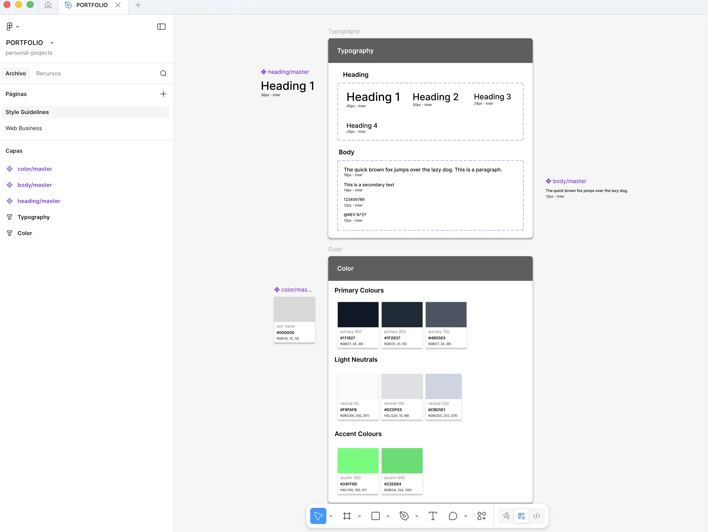
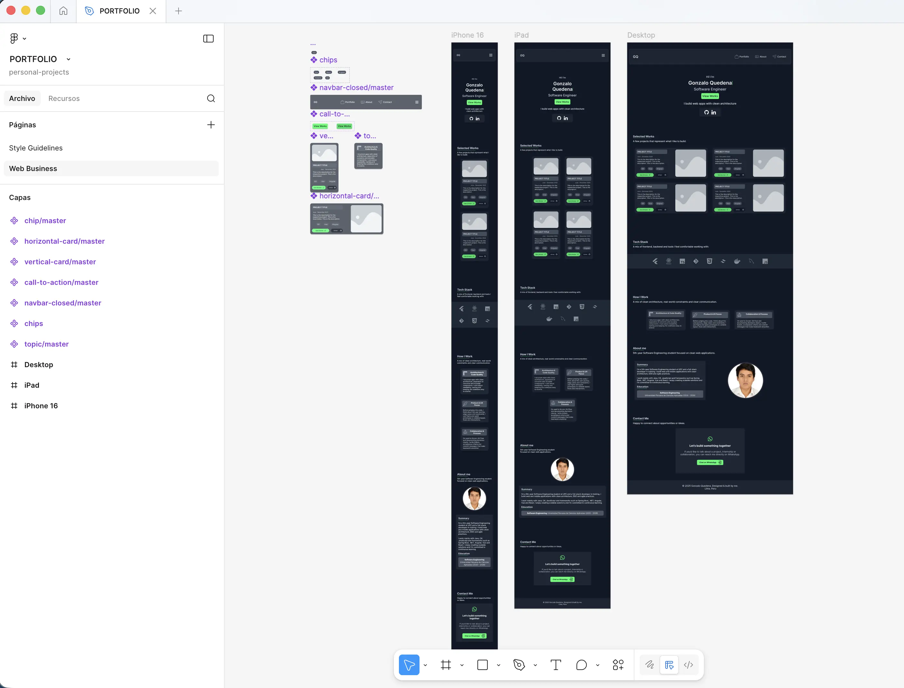

# Design Process

This document outlines the design process followed to create this portfolio, from strategy to implementation.

## 1. Discovery & Strategy

- **Goal Definition**: Create a personal brand presence highlighting software engineering skills and clean architecture.
- **Target Audience**: Recruiters, clients, and developers.
- **Key Message**: Professionalism and technical depth.

## 2. Information Architecture

- **Sitemap**:
  - Home (Hero Section)
  - Portfolio (Selected Works)
  - Tech Stack (Carousel)
  - How I Work (Methodology)
  - About Me (Background & Education)
  - Contact (Call to Action)
- **User Flow**: Single-page smooth scroll for quick access.

## 3. Visual Design & UI

- **Color Palette**: Dark mode (`primary-900`) with green accents (`accent-500`) for a code-editor aesthetic.
- **Typography**: Sans-serif fonts for readability.
- **Iconography**: SVG icons for high resolution.
- **Layout**: Mobile-first grid system using Tailwind CSS.

## 4. Prototyping

<strong>High-Fidelity (Responsive Mockups)</strong> 
Creation of pixel-perfect mockups for iPhone, iPad, and Desktop. This verified the adaptation of the style guidelines and layout across different screen sizes before coding.

  

## 5. Design Artifacts & Visualization

Visual assets created to guide development:

<table>
    <thead>
        <tr>
            <th align="center" width="10%" style="text-align: center;">#</th>
            <th align="center" width="50%" style="text-align: center;">Preview</th>
            <th align="center" width="40%">Description</th>
        </tr>
    </thead>
    <tbody>
        <tr>
            <td align="center" valign="middle"><strong>1</strong></td>
            <td align="center" valign="middle">
                
            </td>
            <td align="justify" valign="middle">
                <strong>Style Guidelines</strong> 
                Defines the portfolio's visual identity: color codes (Dark & Green), typography, and UI states. Acts as the source of truth for CSS variables.
            </td>
        </tr>
        <tr>
            <td align="center" valign="middle"><strong>2</strong></td>
            <td align="center" valign="middle">
                
            </td>
            <td align="justify" valign="middle">
                <strong>Responsive Mockups</strong> 
                High-fidelity visualization across Mobile, Tablet, and Desktop. Validates the layout responsiveness and application of the style guidelines.
            </td>
        </tr>
    </tbody>
</table>

## 6. Development Phase

- **Implementation**: Semantic HTML5, utility-first CSS (Tailwind), and vanilla JavaScript.
- **Refinement**: Tuning animations (typing, scroll fade-ins).
